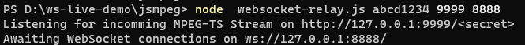
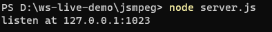
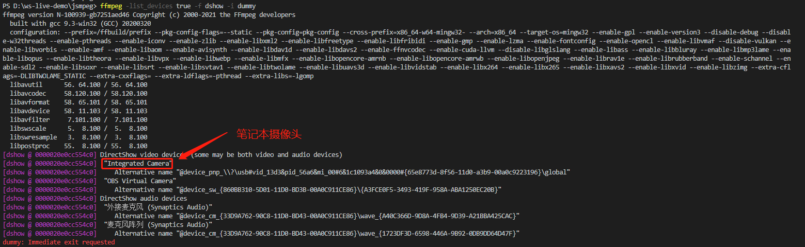
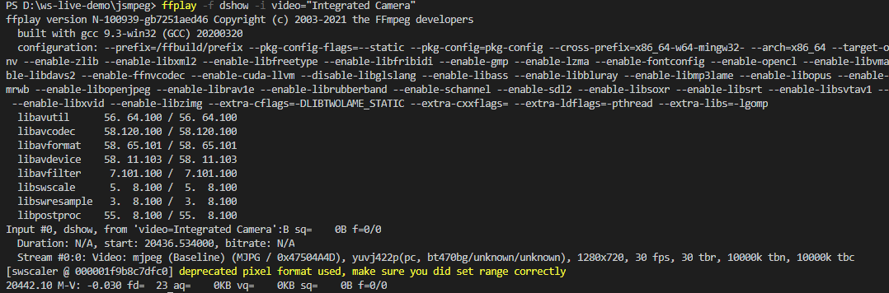

# 直播DEMO说明


## 直播推流

### 1. 创建直播中继服务

```bash
#node  websocket-relay.js videoPassword streamPort websocketPort
node  websocket-relay.js abcd1234 9999 8888 
```

输出：



### 2.ffmpeg 推流

```bash
ffmpeg -f dshow  -i video="Integrated Camera" -framerate 25 -video_size 640x480 -f mpegts -codec:v mpeg1video -video_size 640x480 -b:v 1000k -bf 0  -muxdelay 0.001    http://127.0.0.1:9999/abcd1234
```

## 直播测试服务

启动服务

```bash
#项目根目录执行
#安装项目依赖
npm install
#启动直播测试服务器，仅做测试用，生产环境不需要使用这个服务
node server.js
```

输出：



在浏览器访问http://127.0.0.1:1023/


## 其他：获取本机摄像头（笔记本适用）

### 1. 查看本机设备列表

```bash
ffmpeg -list_devices true -f dshow -i dummy
```

输出：



### 2.播放列表中的设备

```bash
ffplay -f dshow -i video="Integrated Camera"
```

输出：



